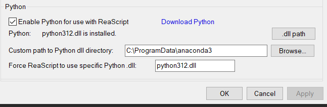

# REAPER MCP Server

> Control REAPER Digital Audio Workstation through AI assistants using the Model Context Protocol (MCP)


## Overview

This Python-based MCP server provides comprehensive control over REAPER DAW through AI assistants. With 104+ specialized tools, you can manage tracks, effects, MIDI, audio items, routing, automation, professional audio analysis, sidechain/bus routing, and advanced mixing/mastering operations—all through natural language commands.

## ✨ Key Features

| Category | Capabilities |
|----------|-------------|
| 🎛️ **Track Management** | Create, rename, color, volume, pan, mute, solo, record arm |
| 🎚️ **FX Control** | Add/remove effects, parameter automation, compressor/limiter presets |
| 🎹 **MIDI Operations** | Create items, add/edit notes, pitch filtering, musical positioning |
| 🎧 **Audio Processing** | Insert files, duplicate items, split, fade, crossfade, reverse |
| 🔗 **Routing & Mixing** | Sends/receives, folder tracks, bus creation, comprehensive routing |
| 🎚️ **Sidechain & Bus** | Sidechain compression, parallel processing, saturation buses, route analysis |
| 🎛️ **Automation** | Envelope creation, point editing, automation modes |
| 🎯 **Project Control** | Tempo, markers, regions, master track, project clearing |
| 📊 **Audio Analysis** | LUFS/loudness measurement, spectrum analysis, stereo imaging, dynamics |
| 🎚️ **Mastering Tools** | LUFS normalization, broadcast compliance, streaming standards |
| 📈 **Gain Staging** | Volume automation generation, clip gain adjustment, peak limiting |
| 📊 **Monitoring** | Peak level metering, crest factor, phase correlation |
| 🎵 **Dual Positioning** | Time (seconds) and musical (measure:beat) notation support |

## 🚀 Quick Start

### Prerequisites
- Python 3.10+
- REAPER DAW installed
- Internet connection (for sample audio downloads)

### 1. Install Dependencies
```bash
pip install -e .
```

### 2. Configure REAPER
1. In REAPER: **Options → Preferences → Plug-ins → ReaScript**
2. Check **"Enable Python for use with ReaScript"**
3. Set **Custom path to Python dll directory** to: `C:\ProgramData\anaconda3`
4. Set **Force ReaScript to use specific Python dll** to: `python312.dll`



### 3. Enable reapy Server
- In REAPER: **Actions → Load ReaScript** → select `reaper_side_enable_server.py` and run it
- Or run from command line: `python reaper_side_enable_server.py`

### 4. Start the MCP Server

**Windows (Recommended):**
```bash
# Double-click this file
start_mcp_server.bat
```

**Command Line:**
```bash
uv run -m src.run_mcp_server
# or
python -m src.run_mcp_server
```

### 5. Test Connection
```bash
# Run MCP inspector
test_mcp.bat
```

## 🎚️ Professional Sidechain & Bus Routing

The REAPER MCP server includes advanced sidechain and bus routing tools for professional mixing and mastering workflows.

### Key Features

| Tool | Purpose | Use Cases |
|------|---------|-----------|
| **`create_sidechain_send`** | Quick sidechain routing setup | Kick → Bass compression, Vocal → Music ducking |
| **`setup_parallel_bus`** | Parallel processing with phase compensation | Parallel compression, parallel EQ, New York style processing |
| **`add_saturation_bus`** | Parallel harmonic enhancement | Tape warmth, tube character, digital excitement |
| **`sidechain_route_analyzer`** | Route validation and analysis | Latency measurement, feedback detection, channel mapping |

### Sidechain Routing Capabilities

- **Channel routing**: Supports both channels 3/4 (standard sidechain) and 1/2 routing
- **Pre/Post fader**: Configurable send positioning for optimal signal flow
- **Level control**: Precise dB-based send level adjustment
- **Real-time validation**: Automatic route analysis and feedback loop detection

### Bus Processing Features

- **Automatic track creation**: Creates properly configured bus tracks
- **Phase compensation**: Built-in latency compensation for parallel processing  
- **Return routing**: Automatic return path setup to master or mix buses
- **Saturation types**: Multiple saturation algorithms (tape, tube, transistor, digital)

### Workflow Examples

**Sidechain Compression (Kick → Bass):**
```python
# 1. Setup sidechain send
create_sidechain_send(
    source_track=0,      # Kick drum
    destination_track=1, # Bass track  
    dest_channels=3,     # Route to sidechain input 3/4
    level_db=-3.0        # Moderate send level
)

# 2. Analyze routing validity
analysis = sidechain_route_analyzer(0, 1)
# Returns: route validity, channel mapping, latency info
```

**Parallel Compression:**
```python
# Create parallel bus with automatic compensation
bus_info = setup_parallel_bus(
    source_track=2,
    bus_name="Vocal Parallel",
    mix_db=-6.0,         # 50/50 blend
    latency_comp=True    # Enable phase alignment
)
# Bus track created at: bus_info.bus_track_index
```

**Parallel Saturation:**
```python
# Add harmonic enhancement bus
sat_bus = add_saturation_bus(
    source_track=3,
    saturation_type="tape",  # Warm tape character
    mix_percent=20.0         # Subtle enhancement
)
# Returns saturation bus track index and FX info
```

### Technical Implementation

- **Real REAPER API integration**: Uses native REAPER routing functions
- **Professional channel mapping**: Proper stereo and sidechain channel configuration
- **Latency measurement**: PDC-based latency calculation and compensation
- **Route validation**: Comprehensive analysis including feedback detection
- **Error handling**: Graceful failure modes with detailed error reporting

## 🔧 Troubleshooting

### Connection Issues (`ConnectionRefusedError`)

**1. Check REAPER Port**
- Open Task Manager > Details tab
- Find `reaper.exe` and check "Local Port" column
- Common ports: 2306 (default), 2307

**2. Enable REAPER Remote API**
```
REAPER → Actions → Show action list → Search "reapy" → Run "reapy: Enable remote API"
```
**Restart REAPER** after enabling.

**3. Test Connection**
```bash
python start_reapy_server_simple.py
```
Should show: "✅ Connection established successfully!"

### Common Issues
| Problem | Solution |
|---------|----------|
| Port mismatch | Update `start_reapy_server_simple.py` with correct port |
| Python not configured | Check REAPER ReaScript Python settings |
| reapy not enabled | Run enable script in REAPER Actions |

## 🔗 MCP Client Integration

### Claude Desktop
Add to your Claude configuration file:

```json
{
    "mcpServers": {
        "reaper-reapy-mcp": {
            "type": "stdio",
            "command": "uv",
            "args": [
                "--directory",
                "C:\\path\\to\\reaper-reapy-mcp",
                "run",
                "-m",
                "src.run_mcp_server"
            ]
        }
    }
}
```

### Cursor IDE
Add to `~/.cursor/mcp.json`:

```json
{
  "mcpServers": {
    "reaper-reapy-mcp": {
      "command": "uv",
      "args": [
        "--directory",
        "C:\\path\\to\\reaper-reapy-mcp",
        "run",
        "-m",
        "src.run_mcp_server"
      ]
    }
  }
}
```

> **Note**: Replace `C:\\path\\to\\reaper-reapy-mcp` with your actual project path.

## 📚 Key Concepts

### Dual Position Format
Tools support both time and musical positioning:

| Format | Example | Use Case |
|--------|---------|----------|
| **Time** | `{"start_time": 15.5}` | Precise timing |
| **Musical** | `{"start_measure": "3:2.5"}` | Musical positioning |

**Musical Format**: `"measure:beat"` (1-based, decimals supported)

### Item ID System
- Zero-based indices per track (0, 1, 2...)
- Stable until items are deleted/reordered
- Consistent across MIDI, audio, and property operations

## 💡 Usage Examples

### Basic Operations
```python
# Create and configure tracks
create_track("Lead Vocal")
set_track_volume(track_index=0, volume_db=-6.0)
add_fx(track_index=0, fx_name="ReaComp")

# MIDI workflow
create_midi_item(track_index=0, start_measure="1:1", length=4.0)
add_midi_note(track_index=0, item_id=0, pitch=60, start_time=0.0, length=1.0)

# Audio processing
insert_audio_item(track_index=1, file_path="vocals.wav", start_time=0.0)
fade_in(track_index=1, item_index=0, fade_length=0.5)
```

### Advanced Routing
```python
# Create folder structure
create_folder_track("Drums")
create_bus_track("Drum Bus") 
set_track_parent(child_track_index=1, parent_track_index=0)

# Sends and routing
add_send(source_track=0, destination_track=2, volume=-6.0)
get_track_routing_info(track_index=0)
```

### Automation
```python
# Volume automation
create_automation_envelope(track_index=0, envelope_name="volume")
add_automation_point(track_index=0, envelope_name="volume", time=0.0, value=0.5)
set_automation_mode(track_index=0, mode="write")
```

### Professional Audio Analysis
```python
# LUFS loudness measurement
loudness_measure_track(track_index=0, window_sec=30.0)
loudness_measure_master(window_sec=30.0)

# Spectrum analysis with weighting
spectrum_analyzer_track(track_index=0, fft_size=8192, weighting="A")
phase_correlation(track_index=0)
stereo_image_metrics(track_index=0)

# Professional mastering workflows
normalize_track_lufs(track_index=0, target_lufs=-16.0, true_peak_ceiling=-1.0)
write_volume_automation_to_target_lufs(track_index=0, target_lufs=-23.0)
master_chain_analysis(window_sec=10.0)  # Broadcast/streaming compliance
```

### Professional Sidechain & Bus Routing
```python
# Sidechain compression setup (kick → bass)
create_sidechain_send(
    source_track=0,      # Kick drum track
    destination_track=1, # Bass track with compressor
    dest_channels=3,     # Route to channels 3/4 for sidechain input
    level_db=-6.0,       # Send level
    pre_fader=True       # Pre-fader send
)

# Parallel compression bus
setup_parallel_bus(
    source_track=2,           # Source track (vocals)
    bus_name="Vocal Parallel", 
    mix_db=-3.0,             # Parallel mix level
    latency_comp=True        # Enable phase compensation
)

# Parallel saturation for harmonic enhancement  
add_saturation_bus(
    source_track=3,          # Source track (drums)
    saturation_type="tape",  # "tape", "tube", "transistor", "digital"
    mix_percent=25.0         # 25% saturation blend
)

# Route analysis and validation
sidechain_route_analyzer(
    source_track=0,     # Kick 
    dest_track=1        # Bass
)  # Returns: validity, channel mapping, latency, warnings
```

## 🛠️ Available Tools (104+ Total)

<details>
<summary><strong>🔌 Connection (1)</strong></summary>

- `test_connection` - Test connection to REAPER
</details>

<details>
<summary><strong>🎛️ Track Management (17)</strong></summary>

- `create_track`, `rename_track`, `set_track_color`, `get_track_color`
- `get_track_count`, `set_track_volume`, `get_track_volume`
- `set_track_pan`, `get_track_pan`, `set_track_mute`, `get_track_mute`
- `set_track_solo`, `get_track_solo`, `toggle_track_mute`, `toggle_track_solo`
- `set_track_arm`, `get_track_arm`
</details>

<details>
<summary><strong>🎚️ FX Management (10)</strong></summary>

- `add_fx`, `remove_fx`, `set_fx_param`, `get_fx_param`
- `get_fx_param_list`, `get_fx_list`, `get_available_fx_list`, `toggle_fx`
- `set_compressor_params`, `set_limiter_params`
</details>

<details>
<summary><strong>🎹 MIDI Operations (6)</strong></summary>

- `create_midi_item`, `add_midi_note`, `clear_midi_item`
- `get_midi_notes`, `find_midi_notes_by_pitch`, `get_selected_midi_item`
</details>

<details>
<summary><strong>🎧 Audio & Items (15)</strong></summary>

- `insert_audio_item`, `duplicate_item`, `delete_item`
- `get_item_properties`, `set_item_position`, `set_item_length`
- `get_items_in_time_range`, `get_selected_items`
- `split_item`, `glue_items`, `fade_in`, `fade_out`
- `crossfade_items`, `reverse_item`, `get_item_fade_info`
</details>

<details>
<summary><strong>🔗 Routing & Mixing (17)</strong></summary>

- `add_send`, `remove_send`, `get_sends`, `get_receives`
- `set_send_volume`, `set_send_pan`, `toggle_send_mute`
- `get_track_routing_info`, `debug_track_routing`
- `clear_all_sends`, `clear_all_receives`
- `create_folder_track`, `create_bus_track`, `set_track_parent`
- `get_track_children`, `set_track_folder_depth`, `get_track_folder_depth`
</details>

<details>
<summary><strong>🎛️ Professional Sidechain & Bus Routing (4)</strong></summary>

- `create_sidechain_send` - Quick sidechain routing (kick → bass compressor)
- `setup_parallel_bus` - Parallel processing with phase compensation
- `add_saturation_bus` - Parallel harmonic enhancement/saturation
- `sidechain_route_analyzer` - Route validation and latency analysis
</details>

<details>
<summary><strong>🎛️ Automation (6)</strong></summary>

- `create_automation_envelope`, `add_automation_point`
- `get_automation_points`, `set_automation_mode`
- `get_automation_mode`, `delete_automation_point`
</details>

<details>
<summary><strong>🎯 Project & Master (14)</strong></summary>

- **Project**: `set_tempo`, `get_tempo`, `clear_project`
- **Markers**: `create_region`, `delete_region`, `create_marker`, `delete_marker`
- **Master**: `get_master_track`, `set_master_volume`, `set_master_pan`, `toggle_master_mute`, `toggle_master_solo`
- **Metering**: `get_track_peak_level`, `get_master_peak_level`
</details>

<details>
<summary><strong>📊 Professional Audio Analysis (14)</strong></summary>

- **Loudness Measurement**: `loudness_measure_track`, `loudness_measure_master`
- **Spectrum Analysis**: `spectrum_analyzer_track`, `spectrum_analyzer_master` 
- **Stereo Analysis**: `phase_correlation`, `stereo_image_metrics`
- **Dynamics Analysis**: `crest_factor_track`, `crest_factor_master`
- **LUFS Normalization**: `normalize_track_lufs`, `match_loudness_between_tracks`
- **Gain Staging**: `write_volume_automation_to_target_lufs`, `clip_gain_adjust`
- **Professional Analysis**: `comprehensive_track_analysis`, `master_chain_analysis`
</details>

## 🤝 Contributing

Contributions are welcome! Please feel free to submit a Pull Request.

### Development Setup
```bash
# Clone and install
git clone <repository-url>
cd reaper-reapy-mcp
pip install -e .

# Run tests
pytest

# Run MCP tool tests only (quiet)
pytest tests/mcp -q
```

## 📄 License

MIT License - see the [LICENSE](LICENSE) file for details.

---

**Ready to control REAPER with AI?** Follow the Quick Start guide above and start creating music with natural language commands! 🎵
